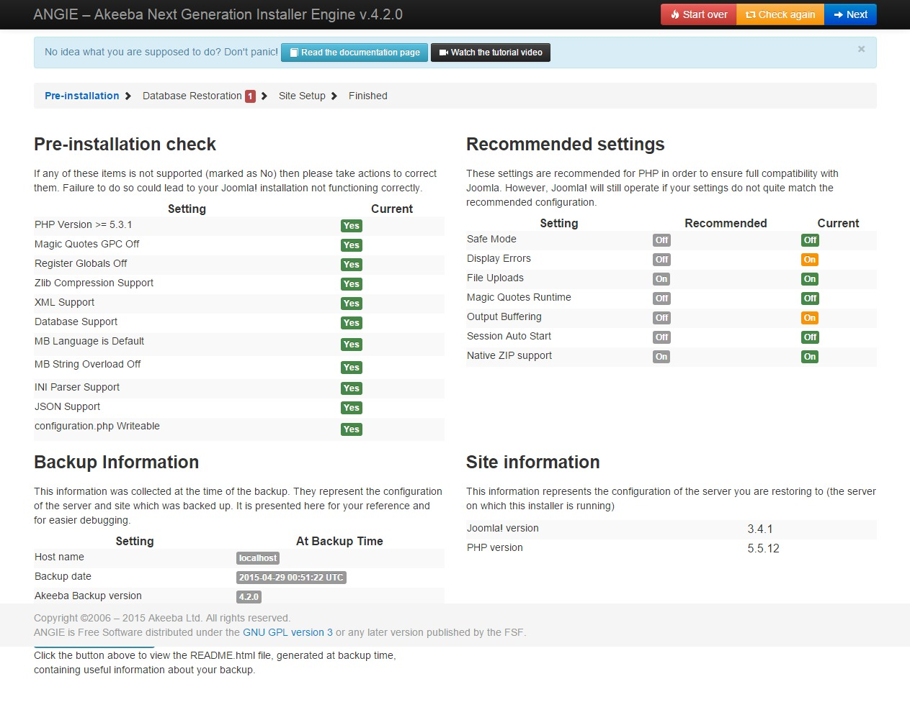
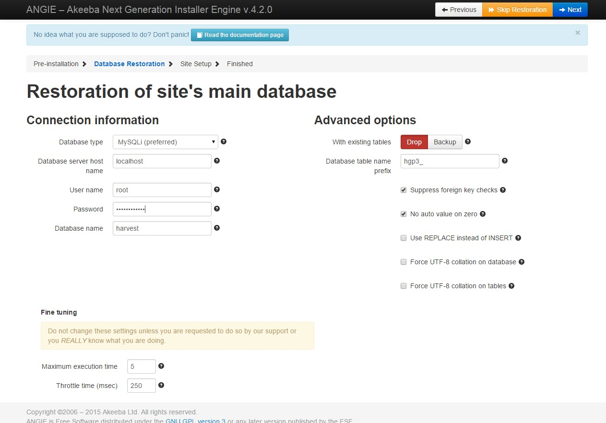
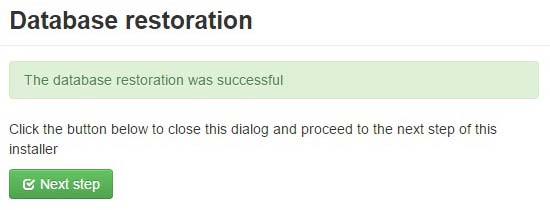
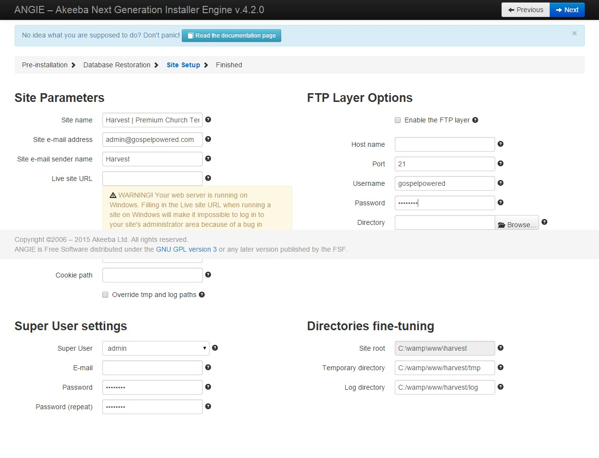
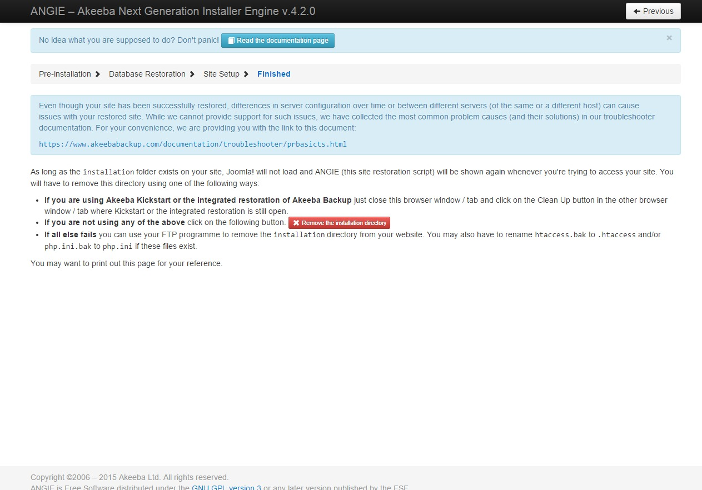
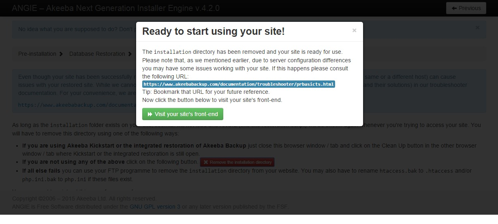

### Overview
All Gospel Powered templates are installed as a quick start package designed to get you started on your site as soon as possible.
The package is a replica of the demo template showcased and is ready to start using out of the box

### Download the package
When purchasing an individual package, you will be sent a link where you can download the complete package file.
If you have purchased a subscription a full installation of your template is already included. If you wish to do the installation yourself, Gospel Powered will provide you the package file.

### Copy to the site
##### Using an ftp client
Using an ftp client log into your site and copy the package file (e.g. harvest.zip) into the public directory of your site (/public_html).
Extract the contents of the package file to the public directory of the site
##### Using cPanel
Log into your cPanel and go to the File Manager. Navigate to the web root directory and upload the package file (e.g. harvest.zip).
Extract the contents of the package file to the public directory of the site.

### Begin the installation
Once the contents of the package file have been extracted navigate to the site name using the browser. eg http://www.mychurchsite.com

The site should display the installation screen

If your host server meets the specified requirements all settings under the Pre-installation check items category should be green. If any requirements are not met check with your host provider or log a ticket at [Gospel Powered](http://gospelpowered.com)

If all requirements are met, click the next button.

### Database setup
Enter the user name, password for the database. You should should have obtained these from your host provider. Enter an available database name to be used. The template does not require a dedicated database as the table name prefix will ensure the tables names will not clash

The following dialog box will prompt you that the database installation was successful.

### Site setup
1. Enter a site name (this is the name displayed in the tab of the browser) and email address details. 
2. Enter the email address and password of the admin super user (you will use this to log into the back-end of your site once the installation is complete)

Once entered click next

### Remove the installation directory
Upon successful installation you will be prompted to remove the installation directory. Click 'Remove the installation directory'

### Finish
Congratuations you are ready to start using your Gospel Powered site. Click 'Visit your site's front-end' to view your site.
