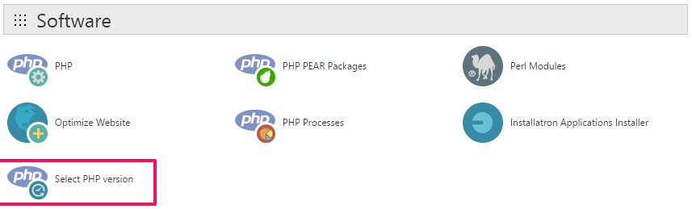

To install any of Gospel Powered templates PHP 5.4+ is required, nowdays most of the web hosting providers will allow you to chose the php version. 

It's really easy to change the PHP version with most of web hosting accounts, all you need to do is follow those step:

1. Log in to cPanel for your accounts
2. Search for **Select PHP version** or **PHP version Manager** , the name may vary based on your hosting provider
3. Select the PHP version, at least 5.4 and click Save.

 {.border .shadow}

That's all.

