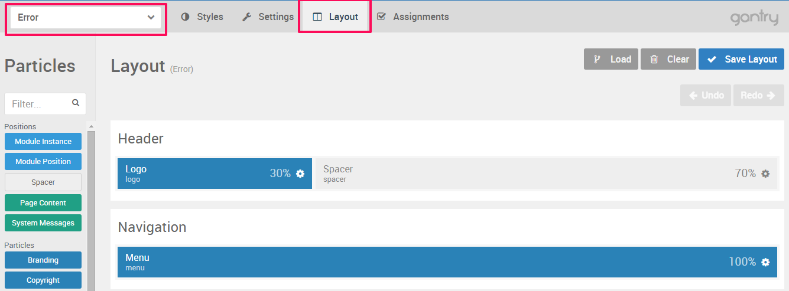

The **error page** can be customized just like any other page. Our templates comes with ready made error page, but may be cases when you want to adjust some text or to create your own page. The error page is mostly used for **404** error.

Navigate to **Admin panel** of the template > **Layout**  and from the **Outline Dropdown** chose **Error**. Now you can add particles or create module positions.

 {.border .shadow}