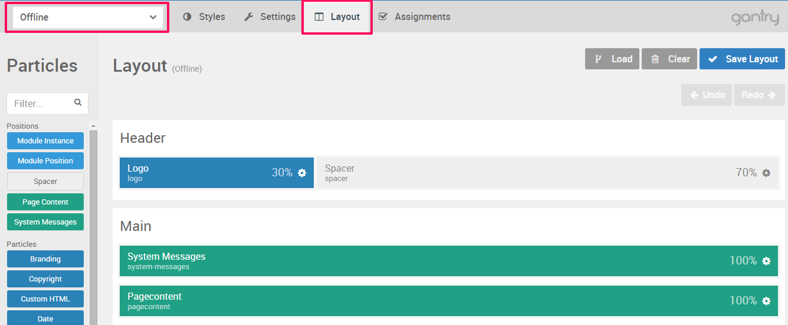

The **offline page** can be customized just like any other page. Our templates comes with ready made offline page, but may be cases when you want to adjust some text or to create your own page.

Navigate to **Admin panel** of the template > **Layout**  and from the **Outline Dropdown** chose **Offline**. Now you can add particles or create module positions.

 {.border .shadow}

